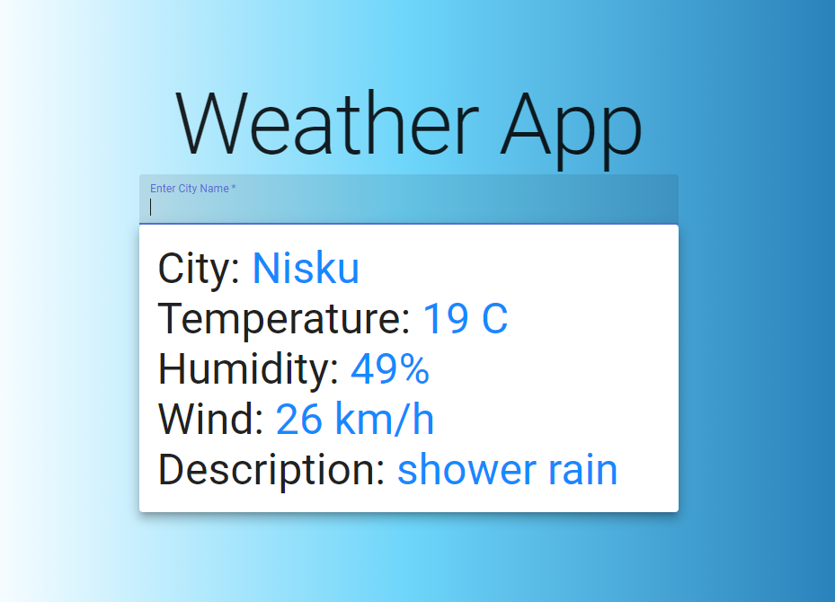

A React weather app made with Next.js. HTML's geolocation API is used to retrieve the user's position which is then used to retrieve weather data from Open Weather Map. The user can also enter a city name in the textfield to retrieve weather data based on city.

